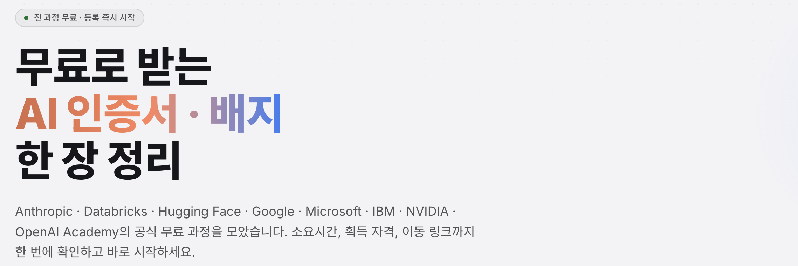

# AISkillPath — 무료 AI 인증서 · 배지 한 장 가이드

🔗 **배포 사이트**: [https://techcert-eight.vercel.app](https://techcert-eight.vercel.app)



외부 교육 기관의 **공식 무료** AI 과정 8종을 한 페이지에 정리한 Next.js 인포그래픽 사이트입니다.
소요시간 · 언어 · 획득 자격 · 이동 링크를 비교하고 바로 시작할 수 있습니다.

> 전 과정 수강 · 평가 · 배지(수료증) 발급까지 **₩0**

## 8개 과정 요약

| # | 기관 | 과정 | 소요시간 | 언어 | 결과물 | 바로가기 |
|---|------|------|----------|------|--------|----------|
| 1 | Anthropic | [AI Fluency: Framework & Foundations](https://www.anthropic.com/ai-fluency) | 3–4시간 | 영문 | 수료증 | [수강 신청](https://www.anthropic.com/ai-fluency) |
| 2 | Databricks | [Generative AI Fundamentals](https://www.databricks.com/kr/training/catalog/generative-ai-fundamentals-accreditation-korean-2784) | 약 1시간 | 영문 / 한국어 | 공식 배지 | [한국어 과정](https://www.databricks.com/kr/training/catalog/generative-ai-fundamentals-accreditation-korean-2784) |
| 3 | Hugging Face | [AI Agents Course](https://huggingface.co/learn/agents-course/unit0/introduction) | 주말 1–2일 | 영문 | 유닛별 Certificate | [코스 시작](https://huggingface.co/learn/agents-course/unit0/introduction) |
| 4 | Google | [Google Skills — Skill Badges](https://www.cloudskillsboost.google/) | 1–4시간 / 배지 | 영문 (일부 한국어) | Skill Badge | [Google Skills](https://www.cloudskillsboost.google/) |
| 5 | Microsoft Learn | [Applied Skills — AI 크레덴셜](https://learn.microsoft.com/en-us/credentials/browse/?credential_types=applied%20skills) | 2–4시간 | 영문 (한국어 UI) | Applied Skills | [AI 크레덴셜 목록](https://learn.microsoft.com/en-us/credentials/browse/?credential_types=applied%20skills) |
| 6 | IBM | [AI Fundamentals — SkillsBuild & Coursera](https://skillsbuild.org/adult-learners/explore-learning/artificial-intelligence) | 약 10시간 | 영문 | IBM 디지털 크레덴셜 | [SkillsBuild](https://skillsbuild.org/adult-learners/explore-learning/artificial-intelligence) |
| 7 | NVIDIA | [DLI 무료 Self-Paced Courses](https://learn.nvidia.com/courses/course-detail?course_id=course-v1%3ADLI%2BS-FX-43%2BV1) | 1–4시간 / 과정 | 영문 | DLI 수료증 | [무료 수강](https://learn.nvidia.com/courses/course-detail?course_id=course-v1%3ADLI%2BS-FX-43%2BV1) |
| 8 | OpenAI Academy | [무료 수료증 과정 (14종)](https://academy.openai.com/pages/courses) | 45분–3시간 / 과정 | 영문 | 수료증 · 배지 | [Academy Courses](https://academy.openai.com/pages/courses) |

## 과정별 상세

### 1. Anthropic — AI Fluency: Framework & Foundations
AI와 효과적이고 안전하게 협업하는 4D 프레임워크(Delegation · Description · Discernment · Diligence)를 배우는 Anthropic 공식 무료 강의. 14개 강의(영상 약 1.1시간) 수료 후 최종 퀴즈를 통과하면 수료증이 발급됩니다. 가장 빠르게 첫 인증서를 받을 수 있는 추천 코스입니다.
- 소요시간 3–4시간 · 영문 · 입문
- 링크: [무료 수강 신청](https://www.anthropic.com/ai-fluency) · [과정 상세 커리큘럼](https://www.anthropic.com/ai-fluency/deep-dive-1-what-is-generative-ai)

### 2. Databricks — Generative AI Fundamentals
생성형 AI의 핵심 개념, 활용 기회 발굴, 거버넌스까지 정리한 뒤 20분 배지 평가(합격선 80%)를 통과하면 공식 배지가 발급됩니다. **한국어(KR) 전용 과정**이 준비되어 있어 접근성이 뛰어납니다.
- 소요시간 약 1시간 · 영문 / 한국어 · 입문 · 배지 만료일 없음
- 링크: [한국어 과정 바로가기](https://www.databricks.com/kr/training/catalog/generative-ai-fundamentals-accreditation-korean-2784) · [영문 과정 · 배지 안내](https://www.databricks.com/learn/training/generative-ai-fundamentals-accreditation)

### 3. Hugging Face — AI Agents Course
Python으로 AI 에이전트를 직접 만들고 배포까지 해보는 실습형 무료 코스. 유닛별 퀴즈를 통과할 때마다 수료 기록이 쌓여 포트폴리오용 증거로 활용하기 좋습니다.
- 소요시간 주말 1–2일 · 영문 · 입문 → 중급
- 링크: [코스 시작하기](https://huggingface.co/learn/agents-course/unit0/introduction) · [코스 홈 · 전체 커리큘럼](https://huggingface.co/learn)

### 4. Google — Google Skills — Skill Badges
Google AI Studio · Gemini · Vertex AI · 프롬프트 디자인 등 클라우드/AI 랩을 완료하면 Skill Badge가 발급됩니다. 도전랩(Challenge Lab)만 통과해도 배지를 빠르게 획득할 수 있습니다.
- 소요시간 1–4시간 / 배지 · 영문 (일부 한국어) · 입문 → 중급
- 링크: [Google Skills 시작](https://www.cloudskillsboost.google/) · [Prompt Design 배지](https://www.cloudskillsboost.google/course_templates/976) · [Google AI Studio: Prompt Design](https://www.skills.google/focuses/129386)

### 5. Microsoft Learn — Applied Skills — AI 크레덴셜
준비 학습 경로를 마친 뒤 브라우저에서 바로 진행하는 랩 평가를 통과하면 Applied Skills 크레덴셜이 발급됩니다. 시험비 0원, 72시간 후 무제한 재응시 가능하며 AI 에이전트 · Copilot 등 AI 관련 크레덴셜이 현재 35종 운영됩니다. 카탈로그가 자주 교체되므로 목록 링크로 최신 항목을 확인하세요.
- 소요시간 2–4시간 · 영문 (한국어 UI) · 입문 → 중급
- 링크: [AI 크레덴셜 무료 응시](https://learn.microsoft.com/en-us/credentials/applied-skills/generate-reports-with-ai-research-agents/) · [Applied Skills 전체 목록](https://learn.microsoft.com/en-us/credentials/browse/?credential_types=applied%20skills)

### 6. IBM — AI Fundamentals (SkillsBuild & Coursera)
IBM SkillsBuild의 Artificial Intelligence Fundamentals(6개 강의 · 약 10시간)를 완주하면 IBM 브랜드 디지털 크레덴셜(Credly 배지)이 발급됩니다. 같은 주제를 Coursera의 IBM 공식 강의로 무료 감사(수강만)할 수도 있으며, 감사 모드에서는 수료증이 나오지 않는 점이 다릅니다.
- 소요시간 약 10시간 · 영문 · 입문
- 링크: [SkillsBuild 무료 수강](https://skillsbuild.org/adult-learners/explore-learning/artificial-intelligence) · [Coursera: Introduction to AI](https://www.coursera.org/learn/introduction-to-ai) · [SkillsBuild 전체 카탈로그](https://skillsbuild.org/learning-catalog)

### 7. NVIDIA — DLI 무료 Self-Paced Courses
NVIDIA Deep Learning Institute의 무료 셀프페이스 과정으로, 클라우드 GPU 워크스테이션이 포함된 실습 랩을 0원으로 사용할 수 있습니다. 무료 과정 중 수료증이 나오는 대표 과정은 `Securing Agents with NemoClaw and OpenShell`(4시간)이며, 무료 카탈로그는 시즌마다 구성이 바뀝니다.
- 소요시간 1–4시간 / 과정 · 영문 · 입문 → 중급
- 링크: [무료 수강 신청](https://learn.nvidia.com/courses/course-detail?course_id=course-v1%3ADLI%2BS-FX-43%2BV1) · [전체 무료 과정 목록](https://www.nvidia.com/en-us/training/find-training/?Free+Courses=Free)

### 8. OpenAI Academy — 무료 수료증 과정 (14종)
OpenAI가 직접 만든 무료 자기주도 과정 14종. 과정을 완주하면 **수료증(Course Completion Certificate)**이 발급되고, 평가(10–20문항)를 80% 이상 통과하면 Accredible 배지가 함께 붙습니다. Foundations · Codex · API 패스웨이의 모든 과정과 평가를 마치면 패스웨이 수료증까지 받을 수 있습니다. 무료 ChatGPT 계정만 있으면 전 세계 어디서나 수강 가능합니다.
- 소요시간 45분–3시간 / 과정 · 영문 · 입문 → 중급
- 링크: [Academy Courses](https://academy.openai.com/pages/courses) · [수료증 · 배지 조건 (공식)](https://help.openai.com/en/articles/20001270-openai-academy-courses)

## 추천 수료 로드맵

| 일정 | 과정 | 메모 | 소요시간 |
|------|------|------|----------|
| DAY 1 | Anthropic AI Fluency | 영상 시청 + 퀴즈로 첫 수료증 획득 | 3–4시간 |
| DAY 2 | Databricks Gen AI Fundamentals | 한국어 과정으로 배지까지 원샷 | 약 1시간 |
| DAY 3–4 | Google Skills Skill Badge | Prompt Design 배지부터 공략 | 3–4시간 |
| 주말 | Hugging Face AI Agents | 실습 몰입 → 유닛별 수료 기록 | 6–10시간 |
| DAY 5 | Microsoft Applied Skills | 짧은 랩 평가로 MS 크레덴셜 확보 | 2–4시간 |
| DAY 6–7 | IBM SkillsBuild AI Fundamentals | 6개 강의 완주 → IBM 디지털 크레덴셜 | 약 10시간 |
| 주말 2 | NVIDIA DLI 무료 과정 | GPU 랩 완주 → NVIDIA 수료증 | 4시간 |
| DAY 8 | OpenAI Academy 수료증 | ChatGPT 계정으로 과정 완주 → 수료증 · 배지 | 45분–3시간 |

## 로컬 실행

```bash
npm install
npm run dev    # http://localhost:3000
```

빌드 · 검사:

```bash
npm run build
npm run lint
```

## 기술 스택

- [Next.js](https://nextjs.org) 16 (App Router · Turbopack)
- React 19 · TypeScript
- Tailwind CSS v4 (CSS 변수 기반 다크/라이트 테마 · `data-theme` 속성 전환)

## 고지

본 저장소는 외부 교육 기관의 **공식 페이지로 연결되는 링크 모음**입니다. 과정 내용 · 배지 조건 · 언어 지원 · 소요시간은 해당 기관 공지에 따라 변경될 수 있으며, 최신 정보는 각 링크의 공식 페이지에서 확인하세요. (2026-10-05 기준)
